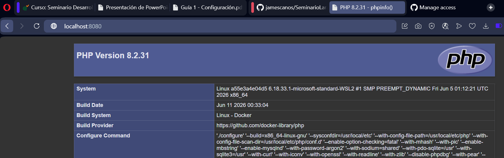

# Mi Proyecto

actividad de github

## Captura 1


## Captura 2



## Captura 3


## Captura 4 variables php


## Captura 5 Arrays php


## Captura 6 funciones y condicionales php


## Instalación

```bash
git clone <repositorio>
cd <proyecto>
```


