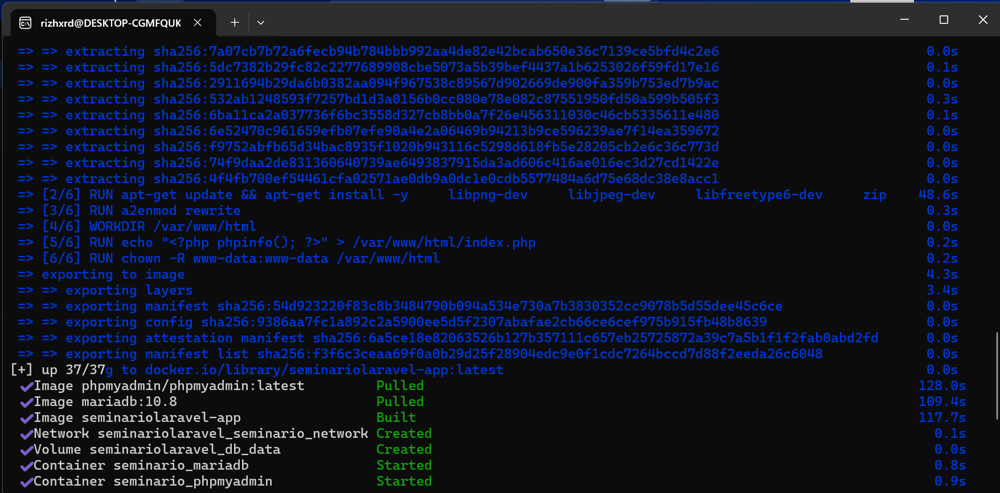
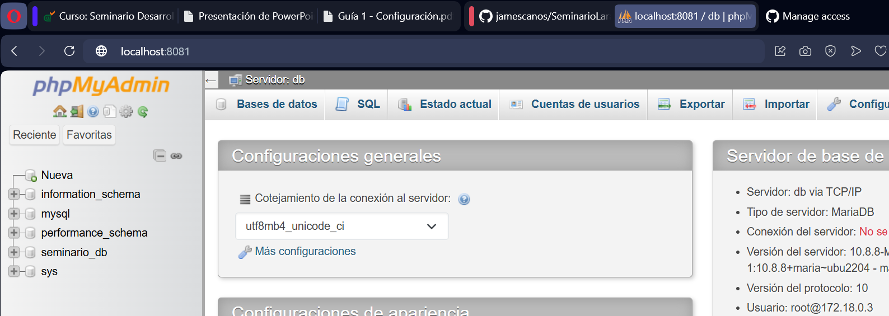
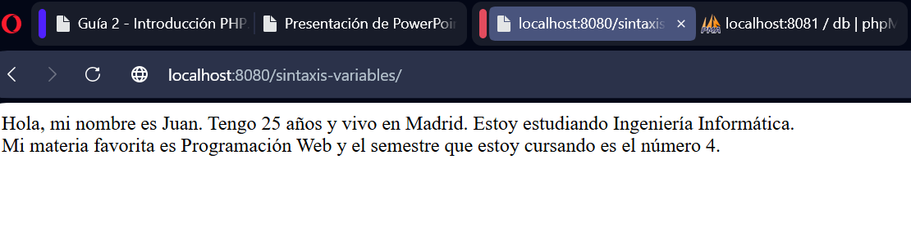
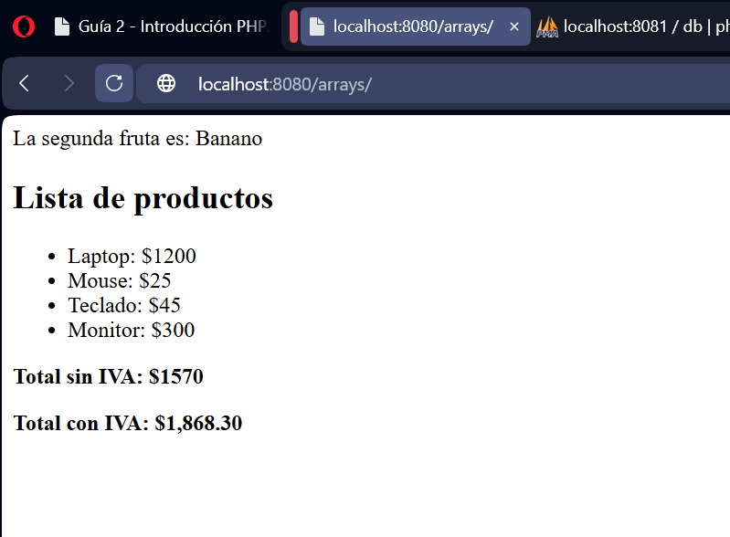
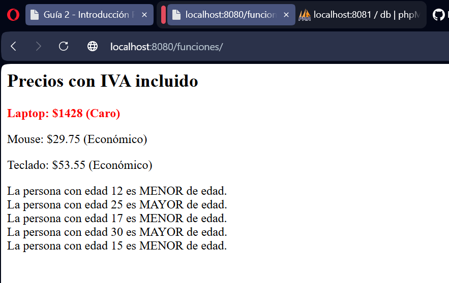
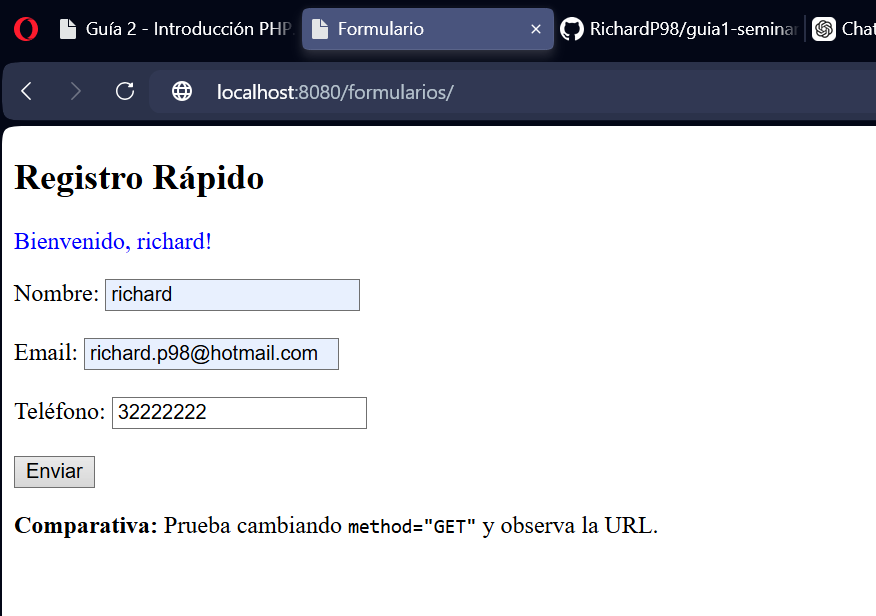
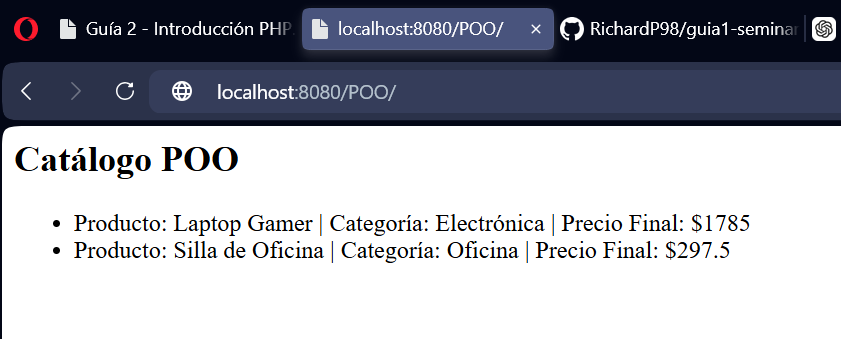
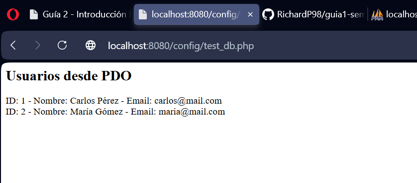
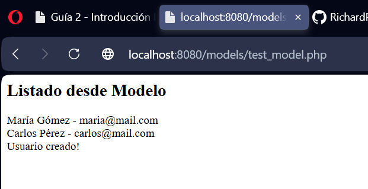

# Mi Proyecto

Actividad de GitHub.

## Captura 1



## Captura 2


## Captura 3



## Captura 4 - Variables PHP



## Captura 5 - Arrays PHP



## Captura 6 - Funciones y condicionales PHP



## Captura 7 - Formularios con PHP



## Captura 8 - POO en PHP



## Captura 9 - databse con POO 



## Captura 10 - Creación del Modelo (M) con CRUD



## Instalación

```bash
git clone <repositorio>
cd SeminarioLaravel
